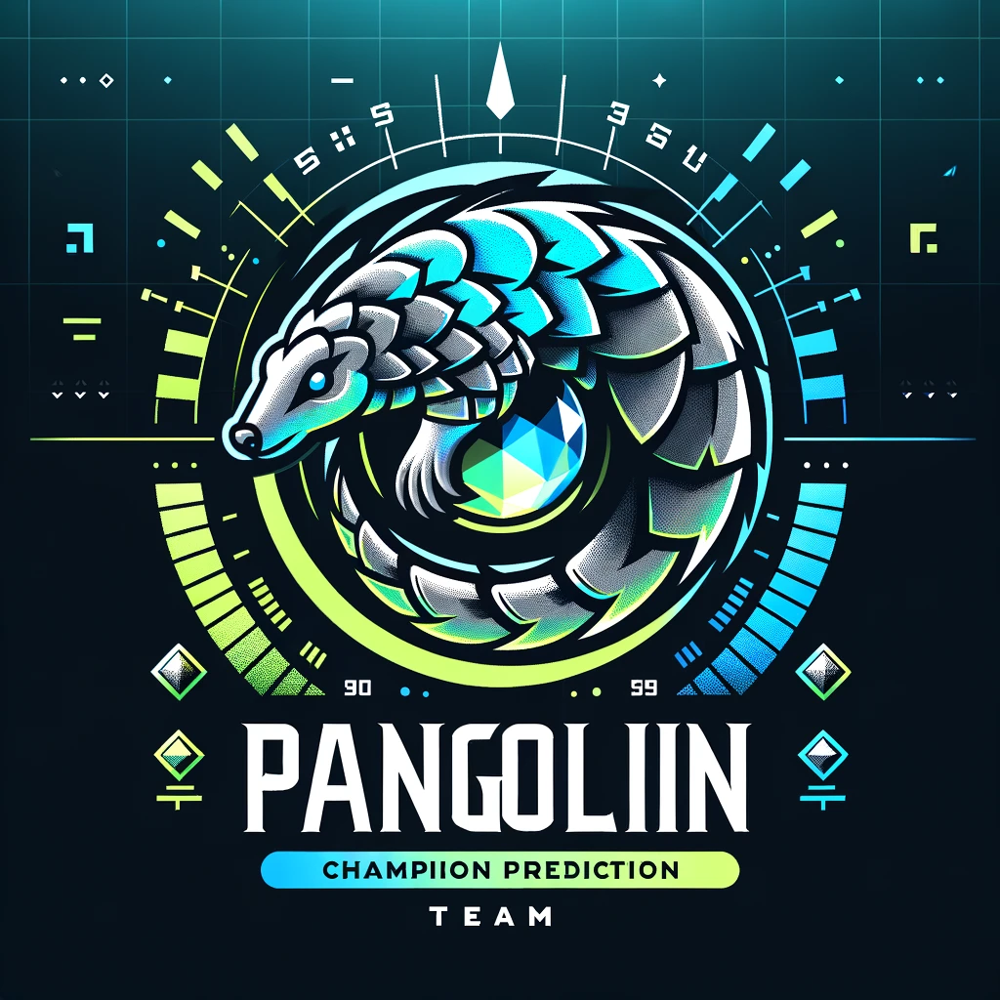

# Champion Edge 

Welcome to Champion Edge, a Streamlit app designed for League of Legends enthusiasts! Champion Edge utilizes advanced machine learning to predict win rates and recommend champions, giving you a strategic advantage before you even enter the Rift.

## DEVELOPER

Team Pangolin: 

- Jaxon Yue
- Yabei Zeng
- Kian Bagherlee
- Poojitha Balamurugan


## Features

- **Win Rate Prediction:** Predict the winning rate for selected champions against opponents.
- **Champion Recommendation:** Suggest optimal champions based on current picks and game dynamics.
- **Interactive UI:** Easy-to-use interface with tabs for introductions, predictions, and recommendations.

## Directory Structure

```plaintext
Champion Edge/
│
├── data/
│   ├── input_data.csv               
├── imgs/
│   ├── favicon.ico                  
│   ├── lol_intro.png 
│   ├── Pangolin.png              
│   └── teemo.png                    
│
├── audio/
│   └── song.mp3                     
│
└── app.py 
│
└── requirements.txt
│
└── style.css 
                        
```

## Installation

To run Champion Edge locally, you will need Python and several dependencies:

1. Clone the repository:
   ```
   git clone https://github.com/yourgithubusername/champion-edge.git
   cd champion-edge
   ```

2. Install the required Python packages:
   ```
   pip install -r requirements.txt
   ```

## Usage

Once the installation is complete, you can run the application using Streamlit:

```bash
python3 -m streamlit run app.py
```

Navigate to `http://localhost:8501` in your web browser to see the app in action.

## Credits

- **Development Team:** Team Pangolin
- **Data Sources:** [League of Legends Statistics](https://gol.gg/teams/list/season-S12/split-ALL/tournament-ALL/)
- **Machine Learning Model:** Random Forest with Random Search deployed ModelBit for predictions (**IMPORTANT**: you need your own api to run the model)

